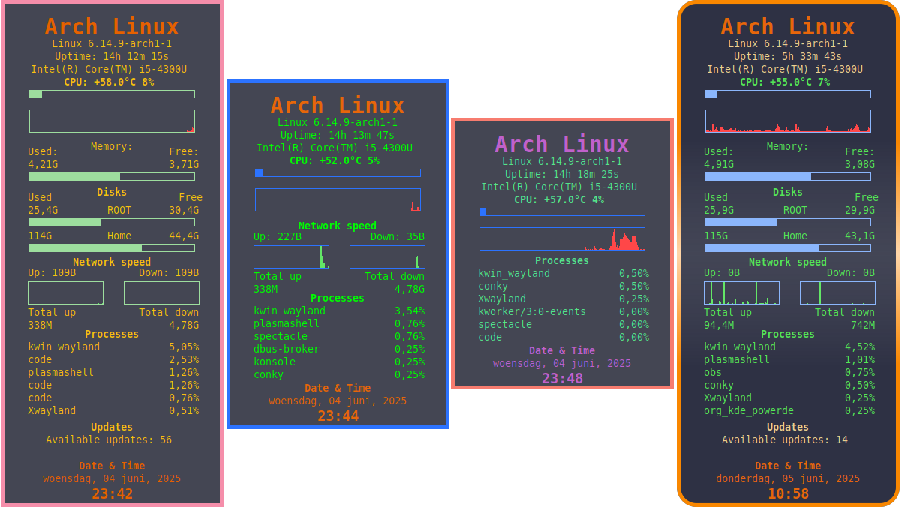
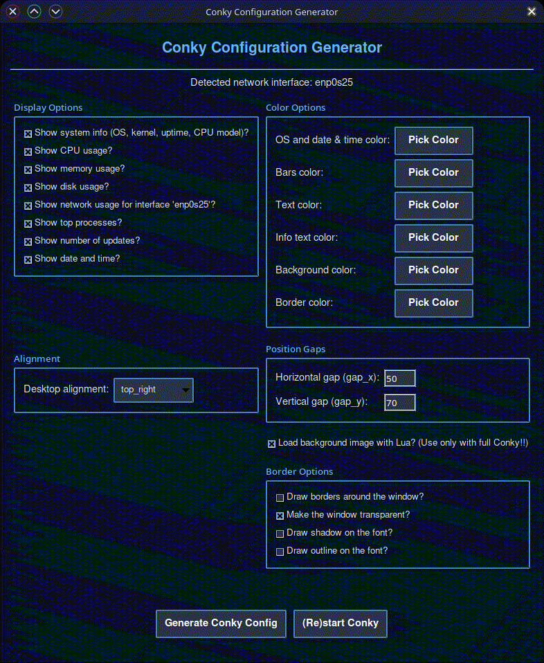

# Conky Generator
Conky Generator is a Python-based tool that allows you to easily create a personalized `conky.conf` configuration file for Conky. Choose between two interfaces: a command-line interface (CLI) with an interactive wizard or a graphical user interface (GUI) for a more visual experience. Customize which system information to display (CPU, memory, disk, network, processes, updates, time), set colors, and configure layout options like alignment and gaps.

## Features
- Two interfaces: CLI (terminal-based) or GUI (Tkinter-based)
- Interactive configuration of displayed information (system info, CPU, memory, disk, network, processes, updates, time)
- Automatic detection of your active network interface
- Color customization via terminal input, Zenity (CLI), or Tkinter color picker (GUI)
- Modern, clean Conky layout with customizable alignment and gaps
- Optional: Background image via Lua (requires full compositing support in Conky)
- GUI-specific: "(Re)start Conky" button to apply changes instantly
- Generates `conky.conf` with a timestamp in the header
- Ready to use immediately after generation

## Requirements
- Python 3
- [Conky](https://github.com/brndnmtthws/conky)
- Optional: [Zenity](https://help.gnome.org/users/zenity/stable/) (for graphical color selection, usually present on most Linux desktops)
- GUI-specific: Tkinter (included with Python on most systems; install with `sudo apt install python3-tk` on Debian/Ubuntu or equivalent)
- Optional for Lua background: Lua package and full compositing support

## Installation of Dependencies
### Ubuntu/Debian
````bash
sudo apt install conky-all lua5.3 zenity python3 python3-tk
````
or
````bash
sudo apt install conky-all lua5.4 zenity python3 python3-tk
````
### Arch Linux
````bash
sudo pacman -S conky lua zenity python3 python3-tk
````
For Conky with Cairo/Lua support, use AUR:
````bash
yay -S conky-cairo
````
### Fedora
````bash
sudo dnf install conky lua zenity python3 python3-tkinter
````

## Installation
Clone this repository:
````bash
git clone https://github.com/wim66/Conky-Generator.git
cd Conky-Generator
````

## Usage
You can choose between the CLI or GUI script to generate your `conky.conf`.

### CLI Script (generate-conky.py)
Start the CLI script by opening a terminal in the Conky-Generator directory.
````bash
python3 generate-conky.py
````
Follow the prompts to configure your Conky setup.

### GUI Script (conky_generator_gui.py)
Start the GUI script by opening a terminal in the Conky-Generator directory.
````bash
python3 conky_generator_gui.py
````
Use the interface to configure your Conky setup.

## Example

 

Added Qt app


## FAQ
### Q: What's the difference between the CLI and GUI scripts?
A: The CLI script (`generate-conky.py`) is terminal-based, ideal for minimal setups or servers. The GUI script (`conky_generator_gui.py`) offers a visual interface with checkboxes, dropdowns, and a color picker, plus a "(Re)start Conky" button for convenience.

### Q: How does the Lua background work?
A: When enabled, Conky loads `assets/BG.png` as a background via `assets/image.lua`. This requires Conky with Lua and full compositing support.

### Q: I get Zenity/GTK warnings in the CLI script. Is this a problem?
A: No, these warnings are harmless and do not affect the script's functionality.

### Q: Can I use the CLI script without Zenity?
A: Yes, choose 'n' when asked about the graphical color picker, then enter hex color codes manually.

### Q: Why does the GUI script require Tkinter?
A: Tkinter is Python's standard GUI library, used for the graphical interface. It's typically included with Python but may need manual installation on some systems.

### Q: Can I place `conky.conf` in my home directory?
A: Yes, copy `conky.conf` to `~/.conkyrc` or `~/.config/conky/conky.conf`, or start Conky with `conky -c /path/to/conky.conf`.

### Q: What does the "(Re)start Conky" button do?
A: It stops all running Conky instances, waits 1 second, and starts Conky with the newly generated `conky.conf`.

## File Structure
- `generate-conky.py`: CLI script for terminal-based configuration.
- `conky_generator_gui.py`: GUI script for visual configuration.
- `assets/BG.png`: Default background image for Lua (if enabled).
- `assets/image.lua`: Lua script for rendering the background image.
- `assets/check_updates.sh`: Script for displaying system updates in Conky.
- `conky.conf`: Generated configuration file (created after running either script).

---

## License
This project is licensed under the MIT License. See the [LICENSE](LICENSE) file for details.

---

Created by Willem @wim66 (https://github.com/wim66).

---