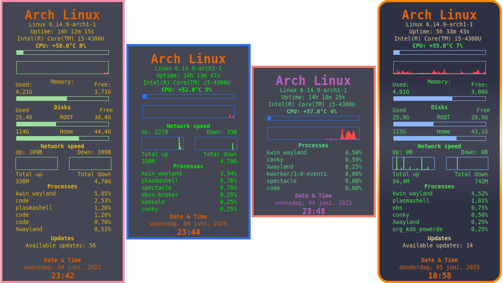

# Conky Generator

**Conky Generator** is a Python script that helps you easily generate a personal `conky.conf` via an interactive wizard. You choose which system information to display (CPU, memory, disk, network, processes, updates, time) and set the colors via the terminal or a graphical color picker (Zenity).

## Features

- Interactive questions about which information to display
- Automatic detection of your active network interface
- Color settings via terminal or graphical color picker (Zenity)
- Modern, clear Conky layout
- **Optional:** Background image via Lua (only works if you run Conky with full compositing)
- Ready to use immediately

## Requirements

- Python 3
- [Conky](https://github.com/brndnmtthws/conky)
- Optional: [Zenity](https://help.gnome.org/users/zenity/stable/) (for graphical color selection, usually present on most Linux desktops)

### Extra: Lua support per distribution

For displaying a background image via Lua in Conky, you need the `lua` package.

- **Ubuntu/Debian:**
    ```bash
    sudo apt install conky-all lua5.3 zenity python3
    ```
    or
    ```bash
    sudo apt install conky-all lua5.4 zenity python3
    ```

- **Arch Linux:**
    ```bash
    sudo pacman -S lua zenity python3
    ```
    Install conky-cairo with yay or paru
    ```bash
    yay conky-cairo
    ```

- **Fedora:**
    ```bash
    sudo dnf install conky lua zenity python3
    ```

## Installation

1. **Clone this repository:**
    ```bash
    git clone https://github.com/wim66/Conky-Generator.git
    cd Conky-Generator
    ```

## Usage

1. **Start the script in a terminal:**
    ```bash
    python3 generate-conky.py
    ```

2. **Answer the questions:**
    - Press **Enter** for the default answer (usually 'yes').
    - Choose whether to use Zenity for color selection (recommended on a desktop).
    - Choose colors or use the defaults.
    - **Background image:** You will be asked if you want to load a background image via Lua. Choose 'yes' to show `assets/BG.png` as a background. This only works if you run Conky with full compositing.

3. **After completion, you will find the `conky.conf` file in the folder.**

4. **Use your new conky.conf:**
    ```bash
    conky -c conky.conf
    ```

## Example



## FAQ

**Q: How does the background image work?**
A: If you choose to use a background image, a PNG is drawn as the background via Lua (`assets/image.lua`).

**Q: I get Zenity/GTK warnings in the terminal. Is this a problem?**
A: No, these warnings are harmless and do not affect the script.

**Q: Can I use the script without Zenity?**
A: Yes, choose 'n' when asked about the graphical color picker. You can then enter colors manually.

**Q: Can I place the file directly in my home directory?**
A: Yes, copy `conky.conf` to `~/.conky` or start Conky with `conky -c /path/to/conky.conf`.

## License

This project is licensed under the MIT License. See the [LICENSE](LICENSE) file for details.

---


---

Created by Willem [@wim66](https://github.com/wim66).