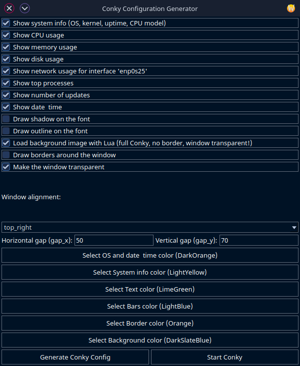

# Conky Generator

Conky Generator is a tool that allows you to easily create a personalized `conky.conf` configuration file for Conky. Choose between three interfaces: a command-line interface (CLI) with an interactive wizard, a Python-based graphical user interface (GUI) using Tkinter, or a Qt-based GUI for a modern, native look. Customize which system information to display (CPU, memory, disk, network, processes, updates, time), set colors, and configure layout options like alignment and gaps.

## Features

- Three interfaces: CLI (terminal-based), Python GUI (Tkinter-based), or Qt GUI (Qt6-based)
- Interactive configuration of displayed information (system info, CPU, memory, disk, network, processes, updates, time)
- Automatic detection of your active network interface
- Color customization via terminal input, Zenity (CLI), Tkinter color picker (Python GUI), or Qt color picker (Qt GUI)
- Modern, clean Conky layout with customizable alignment and gaps
- Optional: Background image via Lua (requires full compositing support in Conky)
- GUI-specific: "(Re)start Conky" button to apply changes instantly
- Generates `conky.conf` with a timestamp in the header
- Ready to use immediately after generation

## Requirements

- Python 3 (for CLI and Python GUI)
- [Conky](https://github.com/brndnmtthws/conky)
- Optional: [Zenity](https://help.gnome.org/users/zenity/stable/) (for graphical color selection in CLI, usually present on most Linux desktops)
- Python GUI-specific: Tkinter (included with Python on most systems; install with `sudo apt install python3-tk` on Debian/Ubuntu or equivalent)
- Qt GUI-specific: Qt6 (install with `sudo apt install libqt5widgets5 libqt5gui5 libqt5core5a qt5-gtk2-platformtheme` on Debian/Ubuntu or equivalent)
- Optional for Lua background: Lua package and full compositing support

## Installation of Dependencies

### Ubuntu/Debian

```bash
sudo apt install conky-all lua5.3 zenity python3 python3-tk libqt5widgets5 libqt5gui5 libqt5core5a qt5-gtk2-platformtheme
```
```bash
sudo apt install conky-all lua5.4 zenity python3 python3-tk libqt5widgets5 libqt5gui5 libqt5core5a qt5-gtk2-platformtheme
```

For Ubuntu GNOME, to ensure the Qt GUI follows the dark theme, run:

```bash
sudo apt install qt5-gtk2-platformtheme
echo "export QT_QPA_PLATFORMTHEME=gtk2" >> ~/.profile
```

Log out and back in after adding the environment variable.

### Arch Linux

```bash
sudo pacman -S conky lua zenity python python-tk qt6-base
```

For Conky with Cairo/Lua support, use AUR:

```bash
yay -S conky-cairo
```

Note: Arch Linux may require additional Qt6 theme packages for dark theme support.

### Fedora

```bash
sudo dnf install conky lua zenity python3 python3-tkinter qt6-qtbase-devel
```

## Installation

Clone this repository:

```bash
git clone https://github.com/wim66/Conky-Generator.git
cd Conky-Generator
```

## Usage

You can choose between the CLI, Python GUI, or Qt GUI to generate your `conky.conf`.

### CLI Script (generate-conky.py)

Start the CLI script by opening a terminal in the Conky-Generator directory:

```bash
python3 generate-conky.py
```

Follow the prompts to configure your Conky setup.

### Python GUI Script (conky_generator_gui.py)

Start the Python GUI script by opening a terminal in the Conky-Generator directory:

```bash
python3 conky_generator_gui.py
```

Use the interface to configure your Conky setup.

### Qt GUI Script (ConkyGenerator)

Start the Qt GUI application by clicking on it


Use the interface to configure your Conky setup, select colors via the Qt color picker, and restart Conky instantly.

## Example

 

Qt GUI screenshot:



## FAQ

### Q: What's the difference between the CLI, Python GUI, and Qt GUI?

A: The CLI script (`generate-conky.py`) is terminal-based, ideal for minimal setups or servers. The Python GUI script (`conky_generator_gui.py`) offers a visual interface with Tkinter, including checkboxes, dropdowns, and a color picker. The Qt GUI (`ConkyGenerator`) provides a modern, native-looking interface with a Qt6-based color picker and a "(Re)start Conky" button for convenience.

### Q: How does the Lua background work?

A: When enabled, Conky loads `assets/BG.png` as a background via `assets/image.lua`. This requires Conky with Lua and full compositing support.

### Q: I get Zenity/GTK warnings in the CLI script. Is this a problem?

A: No, these warnings are harmless and do not affect the script's functionality.

### Q: Can I use the CLI script without Zenity?

A: Yes, choose 'n' when asked about the graphical color picker, then enter hex color codes manually.

### Q: Why does the Python GUI script require Tkinter?

A: Tkinter is Python's standard GUI library, used for the graphical interface. It's typically included with Python but may need manual installation on some systems.

### Q: Why does the Qt GUI appear white on Ubuntu GNOME?

A: The Qt GUI may not follow the dark GNOME theme without the `qt5-gtk2-platformtheme` package and the `QT_QPA_PLATFORMTHEME=gtk2` environment variable. Install the package and add the variable to `~/.profile` as shown above.

### Q: Can I place `conky.conf` in my home directory?

A: Yes, copy `conky.conf` to `~/.conkyrc` or `~/.config/conky/conky.conf`, or start Conky with `conky -c /path/to/conky.conf`.

### Q: What does the "(Re)start Conky" button do?

A: It stops all running Conky instances, waits 1 second, and starts Conky with the newly generated `conky.conf`.

## File Structure

- `generate-conky.py`: CLI script for terminal-based configuration.
- `conky_generator_gui.py`: Python GUI script for visual configuration.
- `main.cpp`: Source code for the Qt GUI application.
- `ConkyGenerator.pro`: Qt project file for compiling the Qt GUI.
- `assets/BG.png`: Default background image for Lua (if enabled).
- `assets/image.lua`: Lua script for rendering the background image.
- `assets/check_updates.sh`: Script for displaying system updates in Conky.
- `conky.conf`: Generated configuration file (created after running any script).

---

## License

This project is licensed under the MIT License. See the [LICENSE](LICENSE) file for details.

---

Created by Willem @wim66 (https://github.com/wim66).

---